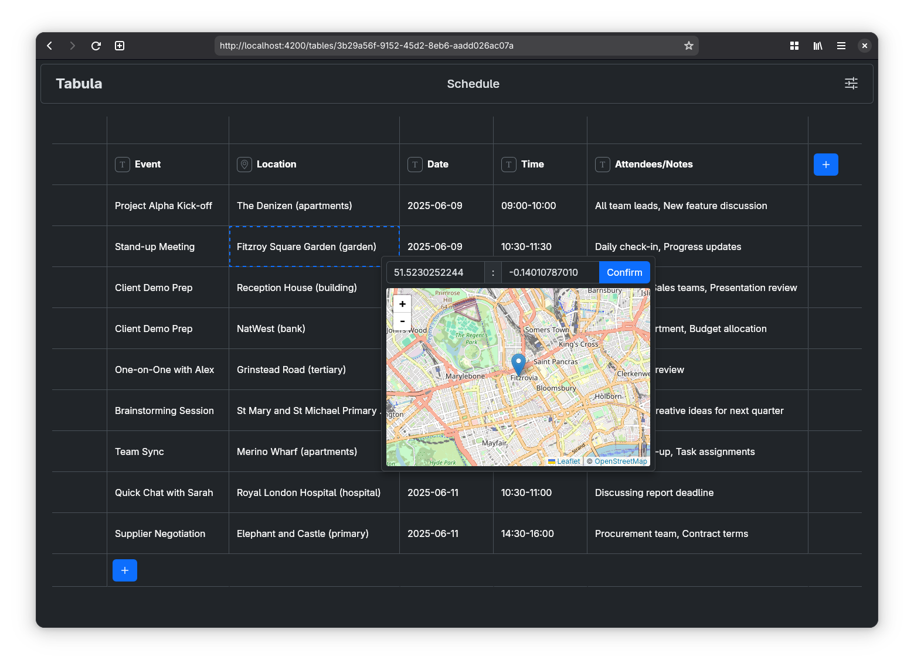

# Tabula



This repository contains two subprojects, one is the backend of the app which is a Java-SpringBoot-PostgreSQL-Gradle
application, while the other is the frontend of the app which is a TypeScript-Angular-NPM app.

To run the project you will first need to [setup the `env` file](#secrets-and-the-env-file) with the database
configuration. Then you can run it with

```sh
git clone https://github.com/bytestrick/tabula.git
cd tabula
./run.sh
```

### How does authentication work?

We use Spring Security and JSON Web Tokens to authenticate users. Here is the authentication flow

1. Initially a client sends a `POST` request to the `/api/v1/auth/sign-in` endpoint with email and password in clear
   text(we assume the use of TLS).
2. It is the responsibility of the `AuthenticationManager` to authenticate the user credentials in the form of a
   `UsernamePasswordAuthenticationToken`. To do this it uses a `DaoAuthenticationProvider` which in turn obtains the
   stored user data from a `DaoUserDetailsService`. The `DaoUserDetailsService` retrieves the user data from the
   underlying database through the `UserDao`. If the `AuthenticationManager` can retrieve the `UserDetails` then it
   will compare them with the ones from the sign in request with a `BCryptPasswordEncoder`.
3. If the authentication is successful we store the `UserDetails` in the `SecurityContext`, this will be the
   `Principal`, then we use the `JwtProvider` to generate a new token which is sent back as the response to the sign-in
   request. The client will store the token in the `localStorage`.


All subsequent requests to the server will have the `Authorization` header set to `Bearer <token>`, this is done by the
`authInterceptor` in the frontend. On the server side the `JwtAuthenticationFilter` will intercept all requests that
need authorization, extract the JWT from them and verify it with the `JwtProvider`. If the verification is successful
the request is accepted otherwise the server responds with HTTP 401.


`JwtProvider` uses a Message Authentication (MAC) signer to sign the JWT and MAC verifier to verify it. These are
created using a high entropy secret that is provided throuh an environment variable and is not to be exposed.

### Secrets and the `.env` file

Before running the backend you must provide it some secrets. It requires a high entropy secret of at least 256 bits to
generate the keys to sign and verify JWTs (see `JwtProvider`), you can generate this with

```sh
openssl rand --hex 32
```

Moreover, it requires datasource credentials and email credentials to send emails to verify the user emails at sign-up
and such. If you decide to provide a Gmail account you
can [create an app password](https://myaccount.google.com/apppasswords) and provide it directly in double quotes.

The `.env` file is placed in `backend/src/main/resources/` next to applications.properties. An example file:

```dotenv
JWT_SECRET=312a8d917893986c44f7f9dea03f0b045a40281f2cb1762082f50348d4e30b50
EMAIL_ADDRESS=tabula.noreply@example.com
EMAIL_PASSWORD="vejr zffv tcda mrqw"
DATASOURCE_URL=jdbc:postgresql://localhost:5432/tabula
DATASOURCE_USERNAME=postgres
DATASOURCE_PASSWORD=postgres
```

## Credits

- <a href="https://www.flaticon.com/free-icons/business-and-finance" title="business and finance icons">Business and
  finance icons created by Freepik - Flaticon</a>
